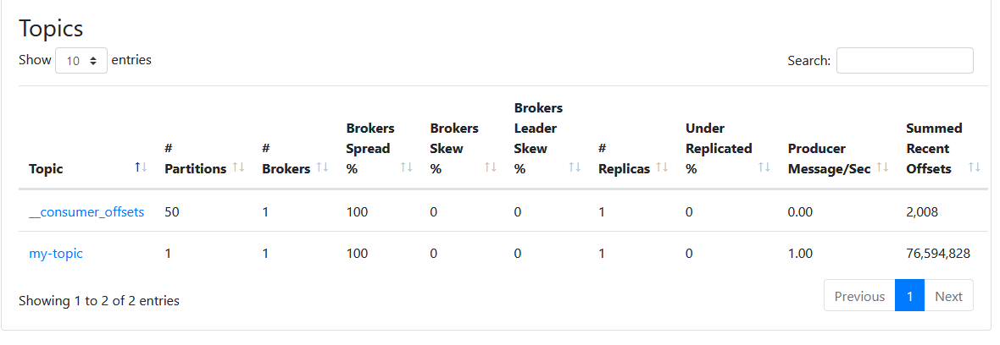

## Rate Limiting and Scheduling

The stream utility has the capacity to either flat out rate limit the streaming data, or adjust the streaming data rate limit using a json file.

### Rate Limit Example

```bash
vscode ➜ /workspace (confluent ✗) $ python log_generator generate --log-type apache --iterations 10000 | python log_generator stream --output kafka --rate 1
Progress:  [█                                   ]    4%  00:28:18
```

In this example we're generating 10,000 Apache log lines, and piping them into the log streamer, with a fixed rate of 1 message per second.

To check if this is working, you can refer to CMAK for an overview of the status for the topic -
 

There will be some overhead with buffering in the transmission phase, so the generated pace may not accurately line up with the reported pace of messages but it's pretty close.

## Scheduling Example

To schedule rate limiting in the streamer, you can call the command in the example shown below, and the json format shown here.

The update interval represents how long it stays at that pace in seconds, in this example 10 seconds. Every 10 seconds it'll jump to the next number in the array, so for the first 10 seconds, it'll stream 10 records a second, then the next 10 seconds stream at a rate of 20 records a second, and finally 1 record a second for the third block of 10 seconds.

At completion of iterating through the array, it'll cycle back the beginning and read the first value and continue iterating.

```json
{
    "update_interval": 10,
    "schedule": [
        10,
        20,
        1
    ]
}
```


```bash
vscode ➜ /workspace (confluent ✗) $ python log_generator generate --log-type apache --iterations 10000 | python log_generator stream --output kafka --schedule testdata/simpleshedule.json
Progress:  [█                                   ]    3%  01:54:18
```

Another example would look something like this, where you change the interval every hour (3600 seconds), and the timings vaguely represent the load variations in the hours throughout the day.

```json
{
    "update_interval": 3600,
    "schedule": [
        1,
        1,
        1,
        1,
        1,
        2,
        2,
        3,
        3,
        3,
        4,
        4,
        5,
        3,
        2,
        2,
        4,
        5,
        6,
        10,
        7,
        5,
        2,
        1,
    ]
}
```

In this example, lunchtime is vaguely busy, and the evening is busy, with early morning being very sparse.
